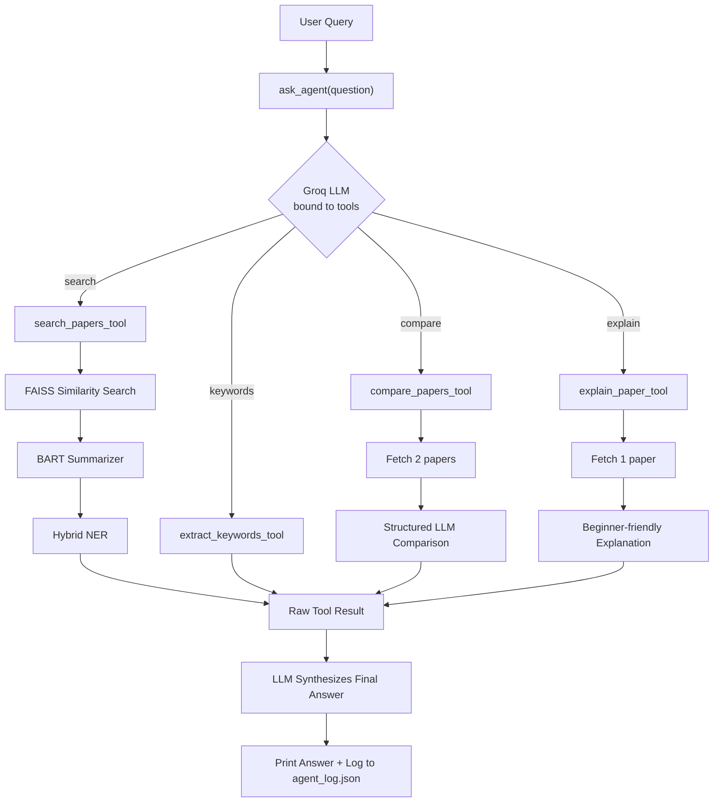

# Architecture

## Overview

This project is an autonomous research agent. Data flows through five stages: retrieval, enrichment, tool wrapping, agent reasoning, and response synthesis.

## Pipeline Diagram

## Pipeline Flow

1. **User Query** enters the system via `ask_agent(question)`.
2. **FAISS Similarity Search** retrieves the top-k most relevant papers (title + abstract).
3. **Enrichment Stage** runs on each retrieved paper:
   - BART Summarizer produces a concise summary
   - KeyBERT extracts top keyphrases
   - Hybrid NER extracts entities (Frameworks, Models, Languages, Organizations)
4. **Four LangChain Tools** wrap this functionality:
   - `search_papers_tool` — search + summarize + entities
   - `extract_keywords_tool` — keyword extraction only
   - `compare_papers_tool` — structured LLM comparison of two papers
   - `explain_paper_tool` — beginner-friendly explanation of one paper
5. **Groq LLM bound to tools** decides which tool fits the user's question.
6. **Tool executes** and returns a raw result.
7. **LLM synthesizes** a final answer from the raw result into natural language.
8. `ask_agent()` prints the answer and logs it to `agent_log.json`.

## Hybrid NER Sub-Architecture

1. **Text input** (a cleaned paper abstract) is passed to two parallel extractors:
   - **Rule-based classifier** — matches against curated lists: Frameworks, Models, Languages, Organizations
   - **HuggingFace NER** (`dslim/bert-base-NER`) — detects general ORG/PERSON/LOC entities
   <!-- NOTE: verify this function name against your notebook — earlier draft had it
        as `classify_query_entities`, which doesn't match the tool names used
        elsewhere in this doc. Rename here to match whatever the notebook actually calls. -->
2. **Filtering layer** applied to HuggingFace's output before merging:
   - Discard subword fragments (words starting with `##`)
   - Discard confidence scores below 0.95
   - Discard words shorter than 4 characters
   - Discard entities that match the paper's own title (self-reference)
   - Discard known dataset names (TIMIT, DAQUAR, MNIST, etc.)
   - Discard generic architecture terms (network, perceptron, etc.)
3. **Merged entity dictionary** — rule-based results plus any new organizations HuggingFace found that passed filtering.

## Known Limitations

- The 0.95 confidence threshold was tuned against a small manual test set (a handful of terms like "Google" vs. "Torch"/"TensorFlow" fragments) rather than a labeled evaluation set — recall on rare or non-Western organization names is untested.
- `compare_papers_tool` assumes both papers were successfully retrieved and summarized upstream; it doesn't gracefully handle the case where one paper's abstract is missing or malformed.
- The dataset exclusion list (TIMIT, DAQUAR, etc.) is manually maintained and will miss newly encountered dataset names until added.

## Why This Structure

- Retrieval is separated from enrichment so any of the four tools can reuse the same query logic without duplicating FAISS code.
- Hybrid NER runs on cleaned abstract text, not the raw query — this ensures entities are detected in actual paper content, not just user input.
- The agent layer is a thin decision layer — it doesn't contain business logic itself, it only routes to the correct tool and passes the result to the LLM for final synthesis. This keeps each tool independently testable.
